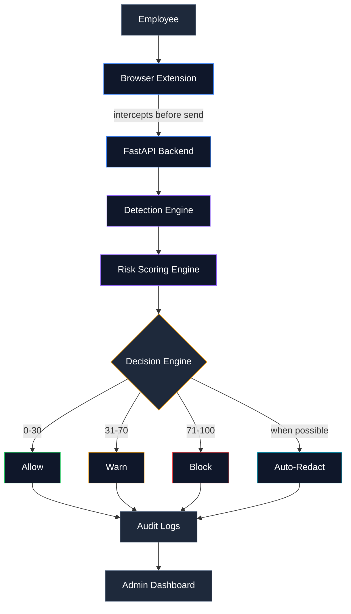
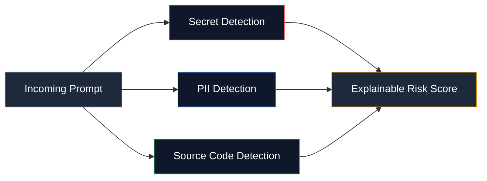
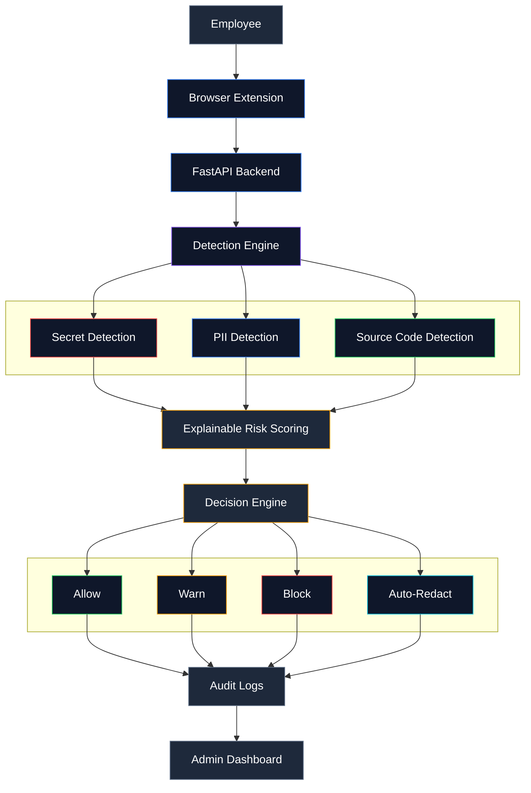

<div align="center">

# 🛡️  ShadowAI

### AI Prompt Security & Governance Platform

**Stops sensitive data leaking into ChatGPT, Claude, Gemini, Copilot, and Perplexity — scanned in the browser, before it ever sends.**

<br/>


---

</div>

<br/>

## Why this exists

People paste things into AI chatbots without thinking twice as an AWS key while debugging, a customer's email while drafting a support reply, a chunk of proprietary code while asking for a refactor. None of it is malicious. All of it is a problem.

**ShadowAI** sits between the employee and the AI tool, reads the prompt in real time, and decides whether it's safe to send entirely inside the browser, before a single character reaches an external server.

No blind trust. No silent blocking either every decision comes with a reason attached.

<br/>

## How it flows



The whole round trip — intercept, scan, score, decide — happens before the prompt is ever allowed to leave the machine.

<br/>

## What's actually checking the prompt

ShadowAI doesn't rely on one model doing all the work. Three detection modules run in parallel, each tuned for a different kind of leak.



<div align="center">

| Module | Catches | Powered by |
|:---|:---|:---|
|  | AWS keys, GitHub tokens, JWTs, passwords, API keys, OAuth tokens, SSH keys | Regex + pattern matching |
|  | Emails, phone numbers, credit cards, Aadhaar, PAN, passport numbers, customer names | Microsoft Presidio, spaCy NER, regex |
|  | Python, Java, JavaScript, C++, Go, SQL | Keyword, import, class/function, and file-structure heuristics |

</div>

Running these in parallel instead of stacking them keeps accuracy high without drowning users in false positives.

<br/>

## Risk scoring, with receipts

Most tools in this space hand you a number and call it a day. ShadowAI shows its work.

```
Risk Score: 87

  AWS Access Key       +40
  Customer Email       +20
  Source Code          +15
  Public AI Platform   +12
```

Every risk score is fully explainable, with each point directly linked to the specific sensitive content or behavior detected by the engine—ensuring complete transparency, not blind trust.

<div align="center">

| Score | Action | Behavior |
|:---:|:---|:---|
| `0–30` |  | Prompt goes through, no friction |
| `31–70` |  | User sees the risk and chooses: cancel, send anyway, or auto-redact — either way, it's logged |
| `71–100` |  | Prompt is stopped per policy, with a clear explanation shown on screen |

</div>

<br/>

## Auto-redaction, not just blocking

Blocking someone outright kills their momentum. Where it's safe to do so, ShadowAI just strips the sensitive part and lets the person keep working.

<table>
<tr>
<td width="50%" valign="top">

**Before**
```
AWS_KEY=AKIA123456789
Customer: john@example.com
```

</td>
<td width="50%" valign="top">

**After**
```
AWS_KEY=[REDACTED]
Customer: [EMAIL]
```

</td>
</tr>
</table>

<br/>

## Full data flow



<br/>

## System components

<table>
<tr>
<td width="33%" valign="top">

### Browser Extension


The first checkpoint. Before "send" actually does anything, the extension grabs the prompt, holds it, and waits for a verdict.

Captured per request:
- User ID and timestamp
- Browser and destination platform
- The prompt text itself

</td>
<td width="33%" valign="top">

### Backend API


Built on FastAPI and Python. Handles auth, runs the full detection pipeline, applies org-level policy, computes the risk score, logs the event, and returns a decision.

</td>
<td width="33%" valign="top">

### Audit & Dashboard


Every scan is logged user, timestamp, destination, score, trigger, decision, override, and policy applied.

Turns raw logs into prompt history, risk analytics, and department-level trends.

</td>
</tr>
</table>

<br/>

## Tech stack

<div align="center">


</div>

<br/>

<div align="center">

---

*Built to keep people productive with AI — without handing over the keys.*

</div>
