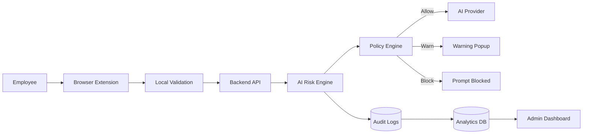
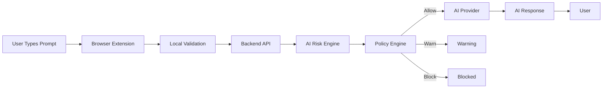
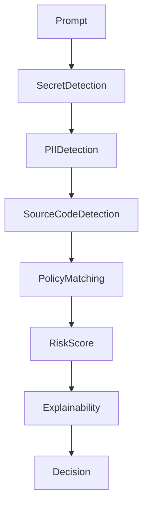
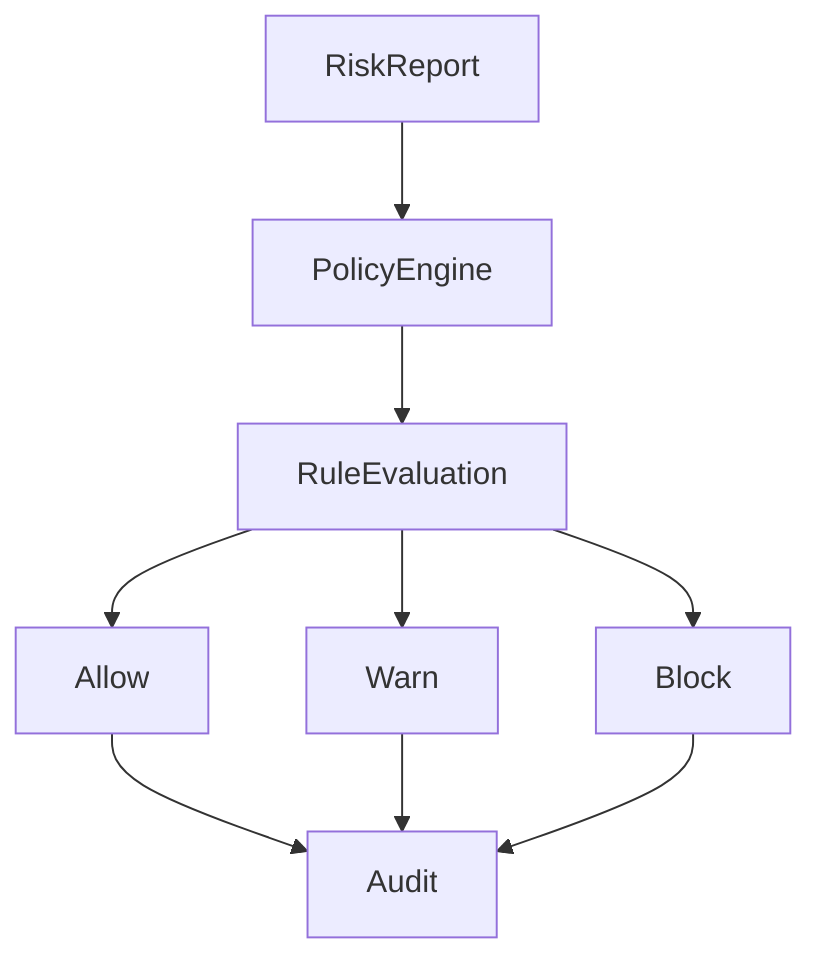
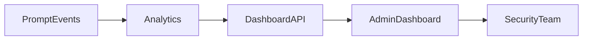
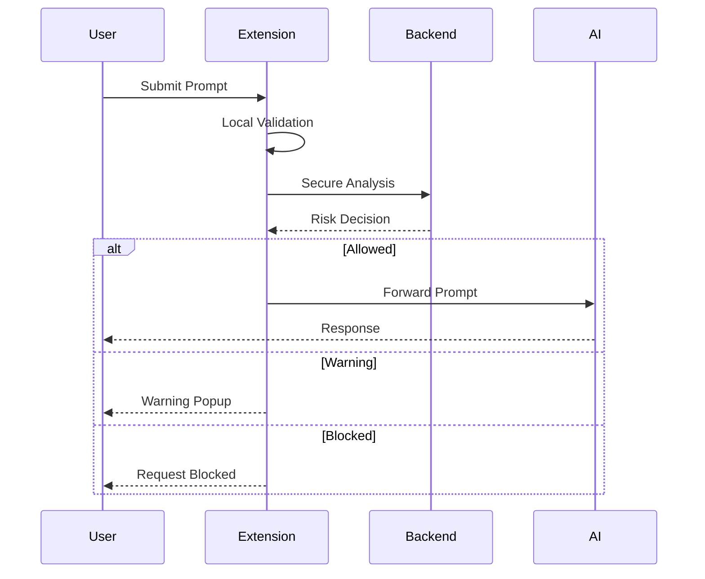
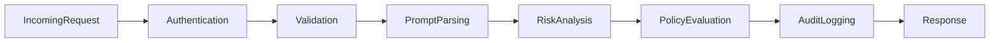
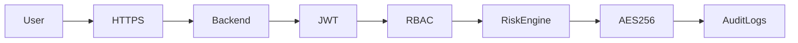

# ShadowAI System Architecture

> This document provides a detailed, real-world architectural overview for **ShadowAI**, an AI-native Data Loss Prevention (DLP) platform.


# 1. High-Level Architecture Overview

ShadowAI protects organizations from accidental or malicious leakage of sensitive data to public AI platforms. Before a prompt reaches ChatGPT, Claude, Gemini, or another LLM, ShadowAI intercepts it, analyzes its contents, evaluates organizational policies, and decides whether to allow, warn, or block the request.



---

# 2. Component Deep Dive

## 2.1 Browser Extension (React + TypeScript + Chrome Extension API)

- **Framework**: React, TypeScript, Chrome Extension Manifest V3.

- **Core Responsibilities**:
  - Intercepts prompts from supported AI platforms such as ChatGPT, Claude, Gemini, and Microsoft Copilot before they are submitted.
  - Performs lightweight client-side validation to detect obvious risks and extracts prompt metadata for further analysis.
  - Communicates securely with the backend using HTTPS REST APIs and displays Allow, Warn, or Block decisions in real time.

- **Key Components:**

  - Content Scripts: Monitor AI websites and capture prompts.
  - Background Service Worker: Manages API communication and extension lifecycle.
  - Popup UI: Displays security status, warnings, and policy notifications.
  
## 2.3 Backend API

- **Framework**: FastAPI, Python.

- **Routing Layer** (/app/routes/):

  auth.py: Authenticates users and manages JWT-based sessions.
  scan.py: Receives prompt analysis requests from the browser extension.
  policy.py: Evaluates prompts against enterprise security policies.
  analytics.py: Provides dashboard metrics and reporting APIs.

- **Services Layer** (/app/services/):

  risk_service.py: Coordinates prompt analysis by invoking multiple detection modules.
  logging_service.py: Records audit logs, incidents, and security events.
  notification_service.py: Sends alerts and notifications for critical incidents.

- **Core Engine** (/app/core/):

  validation.py: Validates incoming requests and sanitizes data.
  security.py: Handles encryption, authentication utilities, and secure communication.
  config.py: Centralized configuration and policy settings.

## 2.3 AI Risk Engine

**Detection Modules:**

- Secret Detector: Detects API keys, passwords, access tokens, AWS secrets, and private keys.
- PII Detector: Identifies emails, phone numbers, Aadhaar numbers, PAN numbers, and other personally identifiable information.
- Source Code Detector: Recognizes programming languages and detects proprietary source code snippets.
- Prompt Injection Detector: Identifies jailbreak attempts, prompt injection techniques, and unsafe instructions.
- Document Classifier: Detects confidential documents, internal URLs, and business-sensitive information.

## 2.4 Policy Engine

- Evaluates risk reports against configurable enterprise security policies and compliance requirements.
- Determines whether a prompt should be allowed, shown with a warning, or blocked based on predefined rules.
- Enables administrators to update security policies centrally without modifying the extension or backend services.

## 2.5 Analytics & Dashboard

- **Framework:** React, Tailwind CSS, Recharts.

- **Dashboard Modules:**

  **Overview**: Displays AI usage, blocked prompts, and security trends.
  **Incident Center**: Lists security incidents with detailed investigation reports.
  **User Analytics**: Tracks AI adoption, risky users, and department-wise activity.
  **Compliance Reports**: Generates audit logs and policy violation summaries.

---

# 3. Core System Flows

## 3.1 Prompt Submission & Analysis




---

## 3.2 AI Risk Assessment



Risk score considers:
- API Keys
- Passwords
- AWS Secrets
- Source Code
- PII
- Internal URLs
- Company policies

---

## 3.3 Policy Enforcement



---

## 3.4 Admin Monitoring



---

# 4. Browser Extension Workflow
The Browser Extension is the entry point of the ShadowAI platform and serves as the first layer of defense against sensitive data leakage. Running directly in the user's browser, it continuously monitors supported AI platforms. Before any prompt is submitted, the extension intercepts the request, performs lightweight local validation, and securely sends the prompt metadata to the backend for a comprehensive security analysis. Based on the returned decision, it either allows the prompt to proceed, warns the user about potential risks, or blocks the request entirely, ensuring confidential information never reaches external AI services without evaluation.




---

# 5. Backend Processing Pipeline
The Backend Processing Pipeline is the central workflow that handles every prompt received from the browser extension. It ensures that each request is securely authenticated, thoroughly analyzed, and evaluated against enterprise security policies before any data is sent to an external AI platform. The pipeline coordinates communication between the AI Risk Engine, Policy Engine, database, and analytics modules while maintaining detailed audit logs for compliance and monitoring




---

# 6. AI Risk Engine

## Detection Modules

| Module | Purpose |
|---------|---------|
| Secret Detector | API keys, passwords, tokens |
| PII Detector | Personal information |
| Source Code Detector | Proprietary code |
| Prompt Injection Detector | Jailbreak attempts |
| Policy Matcher | Enterprise compliance |

Example:

```
Risk Score: 94/100

+40 AWS Secret Key
+25 Source Code
+15 Internal URL
+14 Company Policy Violation
```

Every score is fully explainable.

---

# 7. Security Architecture
The Security Architecture of ShadowAI follows a Zero Trust approach, where every prompt is considered untrusted until it has been analyzed and approved



---

# 8. Scalability & Security Considerations

## Scalability
  - Horizontal Scaling: Multiple backend instances can run behind a load balancer to handle increasing user traffic.
  - Modular Design: Independent services such as the Backend API, AI Risk Engine, and Dashboard can be scaled or updated without affecting the entire system.
  - Optimized Performance: PostgreSQL ensures reliable data storage, while Redis (optional) can be used for faster data access and reduced response times.
## Reliability
  - High Availability: Load balancing ensures uninterrupted service by redirecting requests if a backend instance fails.
  - Audit Logging: Every prompt and security decision is securely logged for compliance, monitoring, and incident investigation.
  - Fault Tolerance: Continuous monitoring and automated recovery mechanisms help maintain system stability and minimize downtime.

## Performance Goals

| Metric | Target |
|---------|--------|
| Prompt Analysis | <100 ms |
| Risk Decision | <150 ms |
| Dashboard Refresh | <2 s |
| Availability | 99.9% |

---
