# ShadowAI System Architecture

> This document provides a detailed, real-world architectural overview for **ShadowAI**, an AI-native Data Loss Prevention (DLP) platform.


# 1. High-Level Architecture Overview

ShadowAI protects organizations from accidental or malicious leakage of sensitive data to public AI platforms. Before a prompt reaches ChatGPT, Claude, Gemini, or another LLM, ShadowAI intercepts it, analyzes its contents, evaluates organizational policies, and decides whether to allow, warn, or block the request.

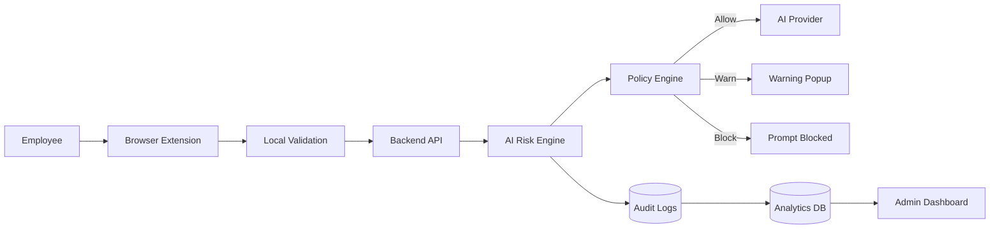

---

# 2. Component Deep Dive

## 2.1 Browser Extension (React + TypeScript + Chrome Extension API)

Framework: React, TypeScript, Chrome Extension Manifest V3.

Core Responsibilities:

  - Intercepts prompts from supported AI platforms such as ChatGPT, Claude, Gemini, and Microsoft Copilot before they are submitted.
  - Performs lightweight client-side validation to detect obvious risks and extracts prompt metadata for further analysis.
  - Communicates securely with the backend using HTTPS REST APIs and displays Allow, Warn, or Block decisions in real time.

Key Components:

  - Content Scripts: Monitor AI websites and capture prompts.
  - Background Service Worker: Manages API communication and extension lifecycle.
  - Popup UI: Displays security status, warnings, and policy notifications.
## Backend API

- Authenticates users, validates requests, and acts as the central communication layer between all system components.
- Coordinates prompt analysis by interacting with the AI Risk Engine and Policy Engine to determine the appropriate action.
- Stores audit logs, records security events, and provides data to the Analytics Dashboard for monitoring and reporting.

## AI Risk Engine

- Analyzes prompts to detect sensitive information such as API keys, passwords, PII, source code, confidential documents, and prompt injection attempts.
- Calculates an explainable risk score by combining the results from multiple detection modules.
- Generates detailed reasoning for every decision, helping users and administrators understand why a prompt was allowed, warned, or blocked.

## Policy Engine
- Evaluates risk reports against configurable enterprise security policies and compliance requirements.
- Determines whether a prompt should be allowed, shown with a warning, or blocked based on predefined rules.
- Enables administrators to update security policies centrally without modifying the extension or backend services.

## Analytics & Dashboard
- Collects AI usage data, audit logs, policy violations, and user activities to provide real-time security insights.
- Visualizes key metrics such as prompt volume, blocked requests, high-risk users, and policy compliance through interactive dashboards.
- Helps security teams investigate incidents, monitor AI adoption, and generate compliance reports for governance and auditing.

---

# 3. Core System Flows

## 3.1 Prompt Submission & Analysis

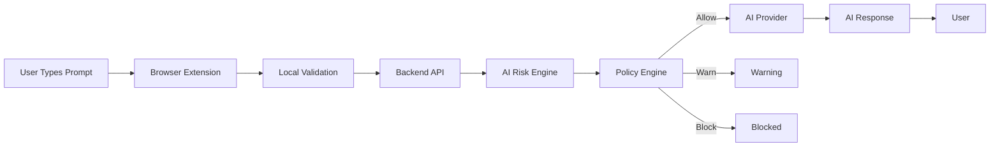

### Flow
1. User submits prompt.
2. Extension intercepts request.
3. Backend performs deep inspection.
4. Risk engine generates findings.
5. Policy engine decides action.
6. AI receives prompt only if allowed.

---

## 3.2 AI Risk Assessment

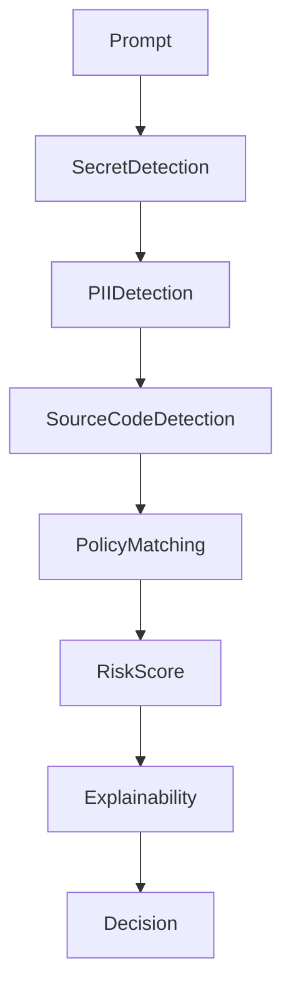

Risk score considers:
- API Keys
- Passwords
- AWS Secrets
- Source Code
- PII
- Internal URLs
- Company policies

---

## 3.3 Policy Enforcement

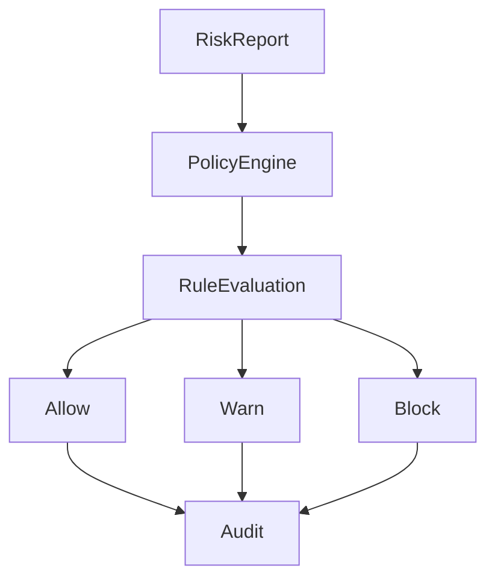

---

## 3.4 Incident & Audit Logging

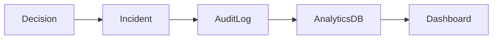

Every decision is logged with:
- Timestamp
- User
- Device
- Risk score
- Triggered rules
- Final action

---

## 3.5 Admin Monitoring

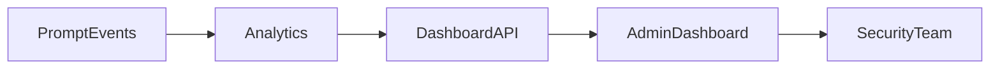

Administrators can:
- View AI usage
- Investigate incidents
- Export compliance reports
- Track risky users

---

# 4. Browser Extension Workflow

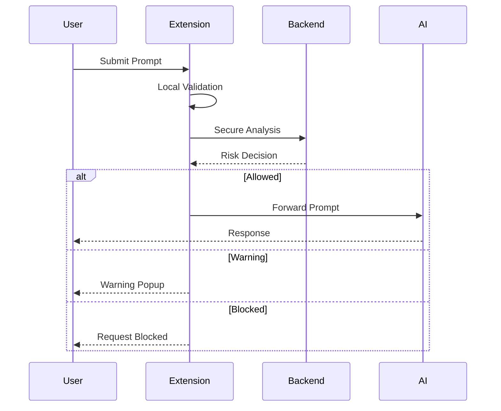

Responsibilities:
- Prompt interception
- Metadata collection
- Secure communication
- UI notifications

---

# 5. Backend Processing Pipeline

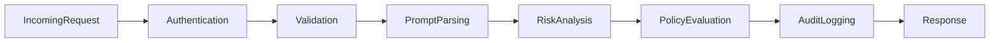

Pipeline stages:
1. Authenticate request
2. Validate payload
3. Extract prompt content
4. Execute detection modules
5. Calculate risk
6. Evaluate policies
7. Store audit record
8. Return decision

---

# 6. AI Risk Engine

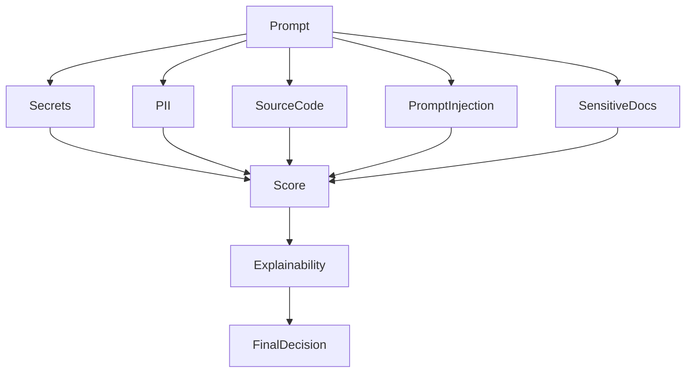

## Detection Modules

| Module | Purpose |
|---------|---------|
| Secret Detector | API keys, passwords, tokens |
| PII Detector | Personal information |
| Source Code Detector | Proprietary code |
| Prompt Injection Detector | Jailbreak attempts |
| Policy Matcher | Enterprise compliance |

Example:

```
Risk Score: 94/100

+40 AWS Secret Key
+25 Source Code
+15 Internal URL
+14 Company Policy Violation
```

Every score is fully explainable.

---

# 7. Security Architecture

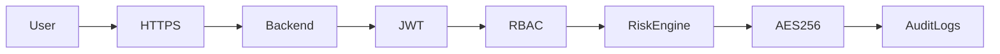

Security principles:

- Zero Trust
- JWT Authentication
- HTTPS/TLS
- Role-Based Access Control
- AES-256 Encryption
- Immutable Audit Logs
- Least Privilege
- Secure Extension Communication

---

# 8. Scalability & Security Considerations

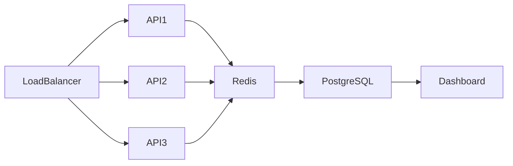

## Scalability
- Stateless backend
- Horizontal scaling
- Redis caching
- Docker containers
- Kubernetes deployment
- Async processing
- API rate limiting

## Reliability
- Health checks
- Centralized logging
- Monitoring & alerts
- Automatic retries
- Backup strategy

## Performance Goals

| Metric | Target |
|---------|--------|
| Prompt Analysis | <100 ms |
| Risk Decision | <150 ms |
| Dashboard Refresh | <2 s |
| Availability | 99.9% |

---

# Conclusion

ShadowAI combines browser-level prompt interception, intelligent risk analysis, enterprise policy enforcement, and explainable AI security into a single platform. Its modular architecture enables organizations to safely adopt generative AI while protecting sensitive information and maintaining regulatory compliance.
