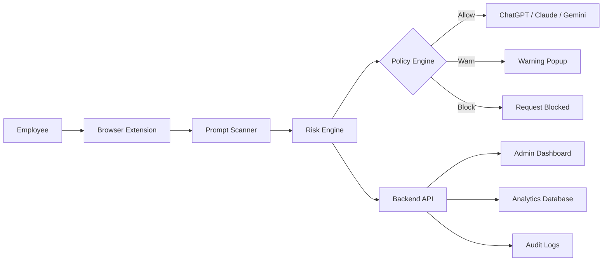
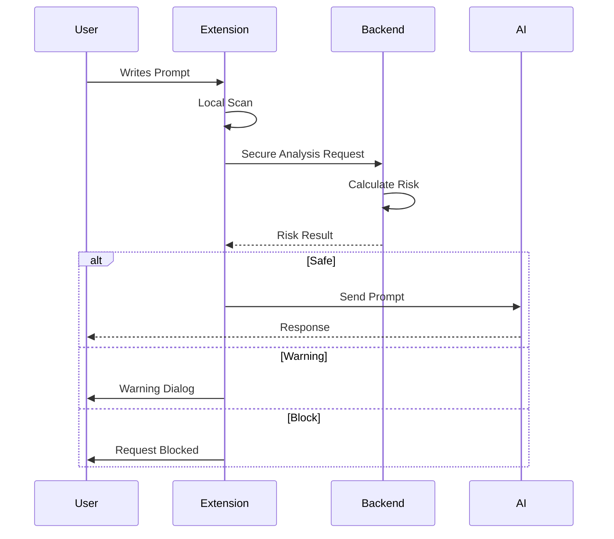
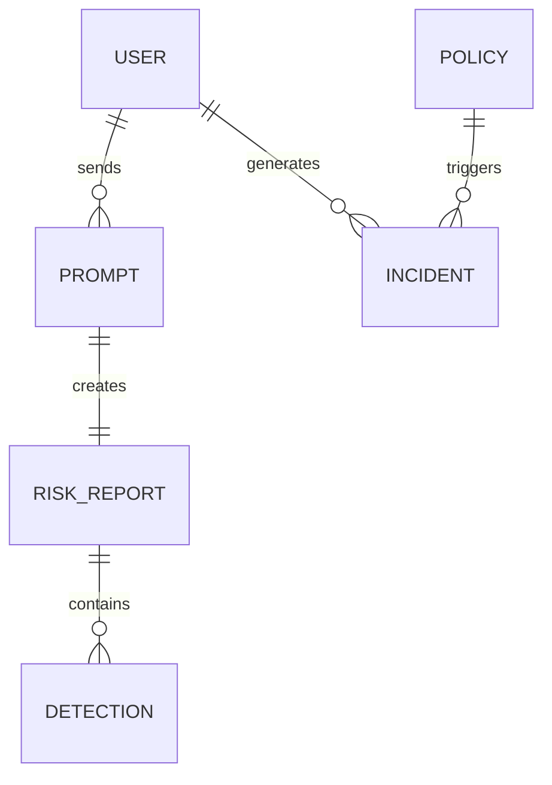

<div align="center">

# 🏗️ ShadowAI System Architecture

### Enterprise-Grade AI Data Loss Prevention Platform

*Real-time Prompt Inspection • Explainable Risk Engine • Zero-Trust AI Security • Browser Extension Monitoring*

</div>

---

# 📑 Table of Contents

1. Architecture Overview
2. High-Level System Design
3. Component Architecture
4. Browser Extension Workflow
5. Backend Processing Pipeline
6. AI Risk Engine
7. Explainability Engine
8. Policy Engine
9. Admin Dashboard
10. Data Flow
11. Security Architecture
12. Scalability
13. Deployment Architecture

---

# 1. Architecture Overview

ShadowAI is an AI-native Data Loss Prevention (DLP) platform designed specifically for modern Generative AI applications.

Instead of blocking websites, ShadowAI understands prompts before they leave the employee's computer.

The platform intercepts AI prompts, analyzes them locally and in the backend, assigns an explainable risk score, enforces enterprise security policies, and provides administrators with complete visibility over AI usage across the organization.

The architecture follows a Zero Trust security model where every prompt is treated as untrusted until evaluated.

---

# 2. High-Level Architecture



---

# 3. Core Components

## Browser Extension

Responsible for

- Detecting supported AI websites
- Reading prompts before submission
- Scanning attachments
- Extracting metadata
- Performing local analysis
- Sending encrypted request to backend

Technologies

- React
- TypeScript
- Chrome Extension API
- Manifest V3

---

## Backend API

Handles

- Authentication
- Policy evaluation
- Risk analysis
- Prompt processing
- Audit logging
- Dashboard APIs

Technologies

- FastAPI
- Python
- JWT Authentication

---

## AI Risk Engine

The heart of ShadowAI.

Instead of simple keyword detection, the Risk Engine combines multiple detectors.

### Detection Modules

✔ API Key Detection

✔ Password Detection

✔ AWS Secrets

✔ Private Keys

✔ Database Credentials

✔ Source Code Detection

✔ Customer PII

✔ Internal URLs

✔ Company Confidential Documents

✔ Prompt Injection Attempts

✔ Jailbreak Prompts

✔ Toxic Content

✔ Data Classification

---

# 4. Browser Extension Workflow



---

# 5. Risk Scoring Engine

Instead of producing a mysterious score, ShadowAI explains every decision.

Example

```
Risk Score : 96 / 100

Reasoning

AWS Secret Key detected
Confidence 99%
+40

Source Code
Detected
+25

Public AI Website
+15

Company Policy Violation
+16
```

### Risk Formula

```
Final Risk Score

=

Secrets

+

Sensitive Data

+

Source Code

+

Policy Violations

+

Destination Risk

-

Trusted Context
```

Every point can be traced back to a specific detector.

No black-box AI.

---

# 6. Explainability Engine

Unlike traditional DLP solutions, ShadowAI explains why a prompt was flagged.

Every alert includes

- Detected entity
- Detector confidence
- Policy violated
- Risk contribution
- Recommended action

Example

```
Blocked because

AWS Secret Key
High Confidence

Company Source Code

Sending to Public ChatGPT

Policy SEC-102 violated
```

This dramatically reduces false positives.

---

# 7. Policy Engine

Administrators create enterprise policies such as

```
Never send

Passwords

API Keys

Private Keys

Source Code

Customer Information

Financial Records
```

Example Rule

```
IF

Destination = ChatGPT

AND

Contains Source Code

THEN

Warn User
```

Another

```
IF

Contains AWS Secret

THEN

Block Immediately
```

---

# 8. Admin Dashboard

The dashboard provides complete visibility into AI usage.

## Dashboard Modules

### Overview

- Total AI Requests
- High Risk Prompts
- Blocked Requests
- Departments
- Top AI Tools

---

### Analytics

Charts

- Daily Usage
- Weekly Trends
- Risk Distribution
- Most Violated Policies

---

### User Management

- Employees
- Departments
- Devices
- Roles

---

### Incident Center

Every blocked request

Includes

- User
- Department
- Timestamp
- Risk Score
- Triggered Rules
- Action Taken

---

# 9. Data Flow

```mermaid
flowchart TD

Prompt

↓

Browser Extension

↓

Local Scanner

↓

Backend API

↓

Risk Engine

↓

Policy Engine

↓

Audit Logs

↓

Dashboard

↓

AI Platform
```

---

# 10. Security Architecture

ShadowAI follows Zero Trust principles.

Features

- JWT Authentication
- HTTPS Everywhere
- AES-256 Encryption
- Secure Audit Logs
- Role Based Access Control
- Rate Limiting
- Browser Sandboxing
- CSP Policies
- Encrypted Storage
- Signed Extension

---

# 11. Database Design



---

# 12. Scalability

ShadowAI is designed using stateless services.

Supports

- Horizontal Scaling
- Load Balancers
- Redis Cache
- Queue Workers
- Docker Containers
- Kubernetes Deployment
- Multiple AI Providers

Expected Throughput

10,000+ Prompt Scans / Minute

---

# 13. Deployment Architecture

```mermaid
flowchart LR

Chrome Extension

↓

FastAPI

↓

Redis

↓

PostgreSQL

↓

Risk Engine

↓

Dashboard

↓

Admin
```

---

# Technology Stack

| Layer | Technology |
|---------|------------|
| Frontend | React |
| Extension | TypeScript |
| Backend | FastAPI |
| Database | PostgreSQL |
| Cache | Redis |
| Authentication | JWT |
| Queue | Celery |
| Deployment | Docker |
| Cloud | AWS |
| Monitoring | Grafana |

---

# Key Design Principles

- Zero Trust Architecture
- Explainable AI Security
- Privacy by Design
- Least Privilege Access
- Real-Time Enforcement
- Modular Detection Engine
- Enterprise Scalability
- High Availability
- Low Latency (<100 ms)
- Complete Auditability

---

# Conclusion

ShadowAI transforms AI security from simple website blocking into intelligent, explainable prompt protection. By combining browser-level interception, contextual risk analysis, enterprise policy enforcement, and transparent decision-making, it enables organizations to embrace Generative AI while safeguarding sensitive information from accidental or malicious exposure.
