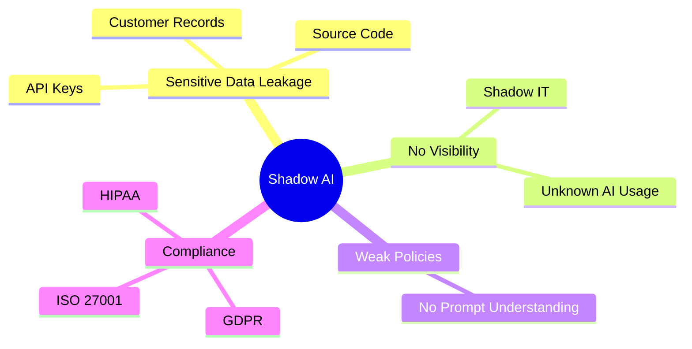
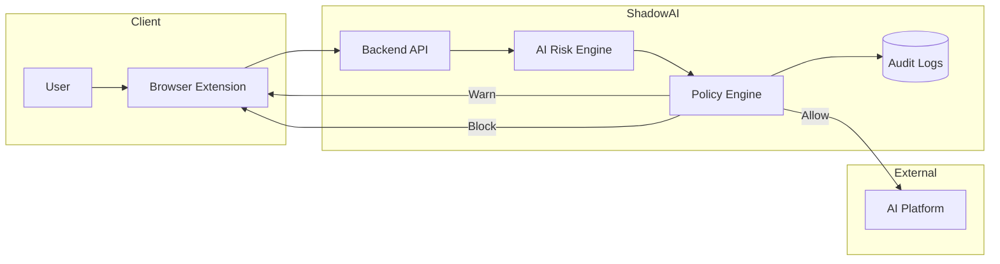
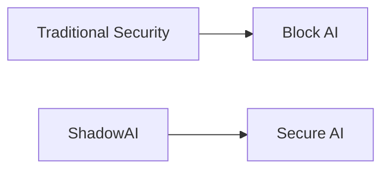

# 🛡️ShadowAI

##   Problem & Solution

### Securing Enterprise AI Usage Without Sacrificing Productivity

---

#  Table of Contents

1.  Problem Statement
2.  Current Challenges
3.  Existing Solutions
4.  Our Solution
5.  Solution Workflow
6.  Key Innovations
7.  Benefits
8.  Why ShadowAI?

---

#  Problem Statement

> **Generative AI has transformed productivity but it has also introduced a new class of security risks.**

Organizations increasingly rely on AI tools like **ChatGPT**, **Claude**, **Gemini**, and **Microsoft Copilot** for coding, documentation, analytics, and content creation.

Unfortunately, employees frequently copy and paste sensitive information into these platforms, including:

  |  Sensitive Data |  Examples |
  |------------------|-------------|
  | API Keys | OpenAI, AWS, Azure Keys |
  | Source Code | Proprietary Algorithms |
  | Customer Data | Emails, Phone Numbers |
  | Credentials | Passwords, Tokens |
  | Documents | Financial Reports |

---

#  Current Challenges

---

#  Existing Solutions

  | Solution | Limitation |
  |-----------|------------|
  |  Firewall | Cannot inspect AI prompts |
  |  Traditional DLP | Designed for emails & files |
  |  Secure Web Gateway | Blocks websites instead of understanding prompts |
  |  AI Website Blocking | Reduces productivity |

> Blocking AI tools solves the symptom and not the problem.

---

#  Our Solution

ShadowAI analyzes prompts **before they leave the user's device**, detects sensitive information, applies enterprise security policies, and provides an explainable decision in real time.

---

#  Key Innovations

|  Innovation | Description |
|--------------|-------------|
|  AI-Native DLP | Built specifically for Generative AI |
|  Explainable Risk | Transparent scoring with reasoning |
|  Real-Time Protection | Decisions before prompts are sent |
|  Policy Enforcement | Configurable enterprise rules |
|  Enterprise Visibility | Centralized monitoring & analytics |

---

#  Benefits

-  Prevents Sensitive Data Leaks by detecting confidential information before it reaches public AI platforms.
-  Enables Safe AI Adoption without blocking productivity or restricting access to AI tools.
-  Provides Explainable Risk Analysis with clear reasons behind every allow, warn, or block decision.
-  Enforces Enterprise Security Policies in real time to ensure consistent governance across the organization.
-  Improves Visibility through centralized monitoring of AI usage, prompt activity, and security incidents.
-  upports Compliance & Auditing by maintaining detailed audit logs for investigations and regulatory requirements.
-  Enhances User Awareness by educating employees about risky prompts through contextual warnings.
-  Scales with Organizational Growth using a modular architecture that supports increasing users and AI platforms.
-  Integrates Seamlessly with existing workflows without requiring changes to users' preferred AI tools.
-  Balances Innovation and Security, allowing organizations to leverage Generative AI confidently while protecting valuable business data.
   
---

# Why ShadowAI?

> Instead of **blocking AI**, ShadowAI **secures AI**.
-  AI-Native Protection – Detects and prevents sensitive data leaks before prompts reach AI platforms.
-  Secure, Don't Block – Enables safe AI usage without reducing employee productivity.
-  Explainable Decisions – Provides transparent reasons for every allow, warn, or block action.
-  Enterprise Visibility – Offers centralized monitoring, audit logs, and policy management.
-  Future-Ready Security – Scalable, modular, and built for the evolving AI ecosystem.

---

## ⭐ Secure AI. Protect Data. Empower Innovation.

