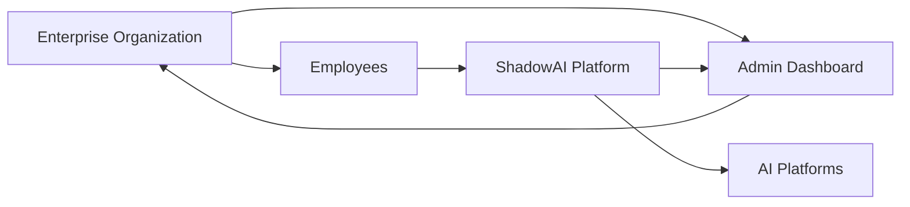

# Business Model

### Building a Sustainable AI Security Platform

 ShadowAI follows a Software-as-a-Service (SaaS) model, providing organizations with a scalable platform to secure AI usage through subscription-based plans.

---

#  Business Overview

As Generative AI becomes part of everyday work, organizations need a reliable way to protect sensitive information without limiting productivity. ShadowAI addresses this need by offering a cloud-based security platform that integrates with existing workflows through a browser extension and an administrative dashboard.

Rather than selling a one-time product, ShadowAI is designed as a subscription service that provides continuous protection, regular updates, analytics, and policy management.

---

#  Business Ecosystem

The ShadowAI ecosystem connects employees, organizations, administrators, and AI platforms through a secure security layer. Employees continue using their preferred AI tools, while organizations gain visibility and control through centralized monitoring and policy management. This approach enables secure AI adoption without disrupting existing workflows.

---

#  Target Customers

ShadowAI is designed for organizations that encourage employees to use AI tools while ensuring company data remains protected.

| Customer Segment | Why They Need ShadowAI |
|------------------|------------------------|
| Small & Medium Businesses | Affordable AI security without dedicated security teams |
| Large Enterprises | Centralized policy management and compliance |
| IT & Security Teams | Monitor AI usage across the organization |
| Software Companies | Protect source code and API credentials |
| Healthcare & Finance | Prevent accidental exposure of regulated data |
| Educational Institutions | Encourage responsible AI usage |

---

#  Value Proposition

ShadowAI helps organizations adopt AI confidently by reducing the risk of sensitive data leakage. Instead of blocking AI tools, it enables employees to continue using them safely through real-time prompt analysis, explainable risk scoring, and centralized security management.

The platform combines security, usability, and visibility into a single solution, allowing organizations to improve productivity while maintaining control over confidential information.

---

# Revenue Model

The primary source of revenue is a subscription-based licensing model.

| Plan | Target Users | Features |
|------|--------------|----------|
| Free | Individuals & Students | Basic prompt protection |
| Professional | Small Teams | Dashboard, analytics, policy customization |
| Enterprise | Large Organizations | Unlimited users, audit logs, SSO, priority support |

Additional revenue opportunities include enterprise onboarding, security consulting, premium compliance reports, and custom integrations for organizations with specialized requirements.

---

# Growth Opportunities

ShadowAI is designed with a modular architecture, making it easy to expand beyond browser-based AI tools.

Future opportunities include:

- Integration with Microsoft Copilot, Claude, and other AI platforms.
- VS Code and IDE extensions for developers.
- Slack, Microsoft Teams, and enterprise collaboration tools.
- AI governance and compliance reporting.
- Advanced analytics powered by machine learning.
- Enterprise identity and access management integrations.

---

# Business Summary

ShadowAI combines a growing market, a scalable SaaS model, and increasing enterprise demand for AI security. As organizations continue adopting Generative AI, the need for secure and explainable AI usage will continue to grow, positioning ShadowAI as a practical solution for modern workplace security.

---

**Protect Data • Empower Teams • Scale with Confidence**

