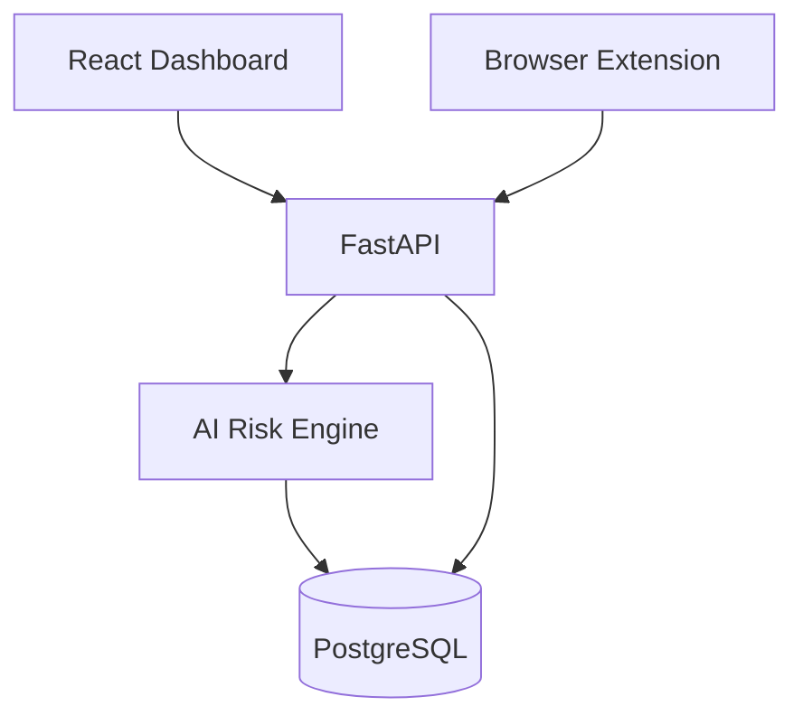

#  Tech Stack

### Technologies Used in ShadowAI

---

#  Overview

ShadowAI is built using a combination of modern web technologies and AI libraries. We selected each technology based on performance, ease of development, and its ability to support real-time prompt analysis.

| Layer | Technology |
|--------|------------|
| Frontend | React + TypeScript |
| Browser Extension | Chrome Extension API |
| Backend | FastAPI |
| AI Processing | Python |
| NLP | spaCy |
| Sensitive Data Detection | Microsoft Presidio |
| Pattern Matching | Regular Expressions |
| Database | PostgreSQL |
| Authentication | JWT |

---

#  Frontend

The Admin Dashboard is built using **React** and **TypeScript**, making it responsive, maintainable, and easy to extend.

| Technology | Why We Used It |
|------------|----------------|
| React | Build a fast and interactive dashboard |
| TypeScript | Reduce bugs with type safety |
| Tailwind CSS | Quickly create a clean UI |
| ShadCN UI | Ready-made modern components |
| Recharts | Display analytics and reports |

---

#  Browser Extension

The browser extension is responsible for detecting prompts before they are submitted to AI platforms.

| Technology | Why We Used It |
|------------|----------------|
| Chrome Extension API | Access browser events and AI webpages |
| Manifest V3 | Latest extension standard |
| TypeScript | Reliable extension logic |

**Main Responsibilities**

- Detect prompt submissions
- Capture prompt content
- Send requests securely to the backend
- Show warning or block popups

---

#  Backend

The backend handles communication between the extension, AI engine, and dashboard.

| Technology | Why We Used It |
|------------|----------------|
| FastAPI | Fast and lightweight API framework |
| Python | Easy integration with AI libraries |
| Pydantic | Request validation |
| JWT | Secure authentication |

The backend is responsible for:

- Processing prompts
- Running security checks
- Applying policies
- Saving audit logs

---

#  AI & Detection

This is the core of ShadowAI. Different detection methods work together to identify sensitive information inside prompts.

| Technology | Purpose |
|------------|---------|
| Microsoft Presidio | Detect personal and sensitive information |
| spaCy | Identify names, organizations, and locations |
| Regular Expressions | Detect API keys, passwords, and tokens |
| Custom Risk Engine | Calculate the final risk score |

The AI engine is the core of ShadowAI. Instead of relying on a single detection method, it combines multiple techniques to identify sensitive information with greater accuracy. **Microsoft Presidio** is used to detect personally identifiable information, while **spaCy** performs Named Entity Recognition to identify names, organizations, and locations. Regular expressions help identify structured patterns such as API keys, passwords, and authentication tokens. The results from these detectors are combined to generate a final risk score that determines whether a prompt should be allowed, warned, or blocked.

---

#  Database

PostgreSQL stores all application data.

It keeps track of:
- Users
- Security Policies
- Audit Logs
- Risk Scores
- Dashboard Analytics

---

#  Security

To keep communication secure, ShadowAI uses:
- JWT Authentication
- HTTPS Communication
- Role-Based Access Control
- Audit Logging
- Policy-Based Decisions

---

#  Development Tools

| Tool | Purpose |
|------|---------|
| Git & GitHub | Version Control |
| VS Code | Development |
| Postman | API Testing |
| Figma | UI Design |
| Mermaid | Architecture Diagrams |

---

#  Architecture Overview

---

#  Why This Stack?

We chose this stack because it is simple, reliable, and well-suited for building a real-time security application. React provides a smooth user experience, FastAPI offers fast API performance, Python integrates easily with AI libraries, and PostgreSQL ensures reliable data storage. Together, these technologies make ShadowAI easy to develop, scalable, and ready for future enhancements.
